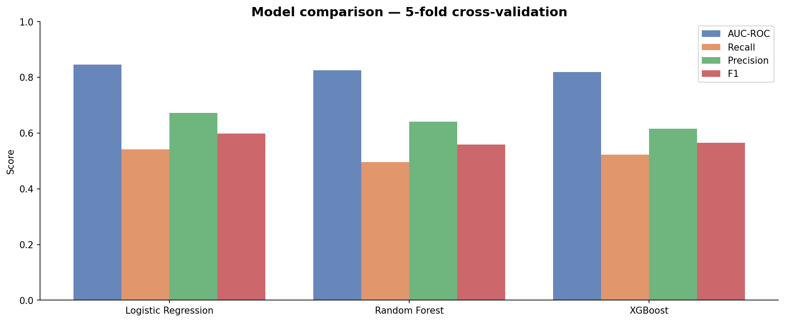
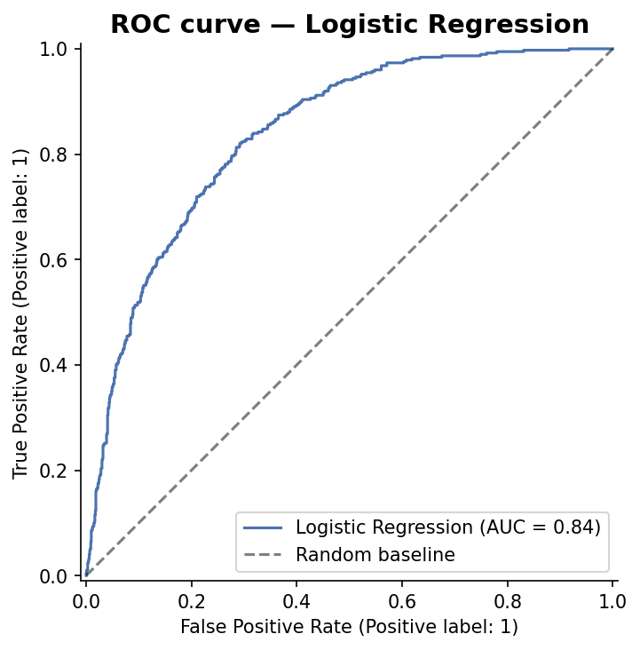
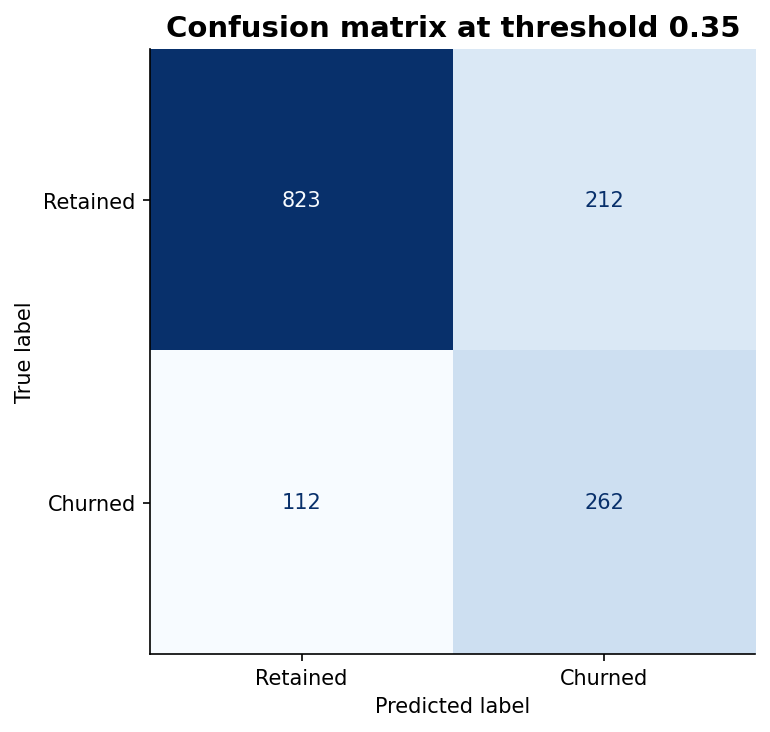
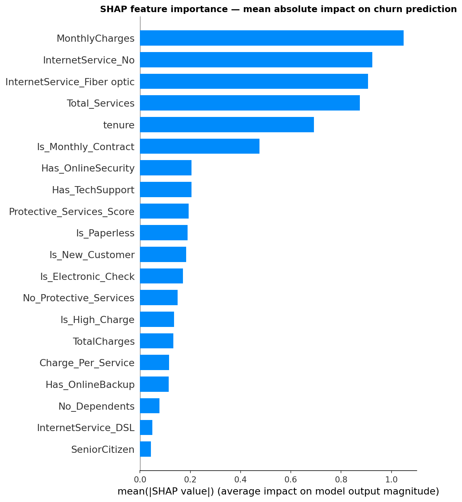
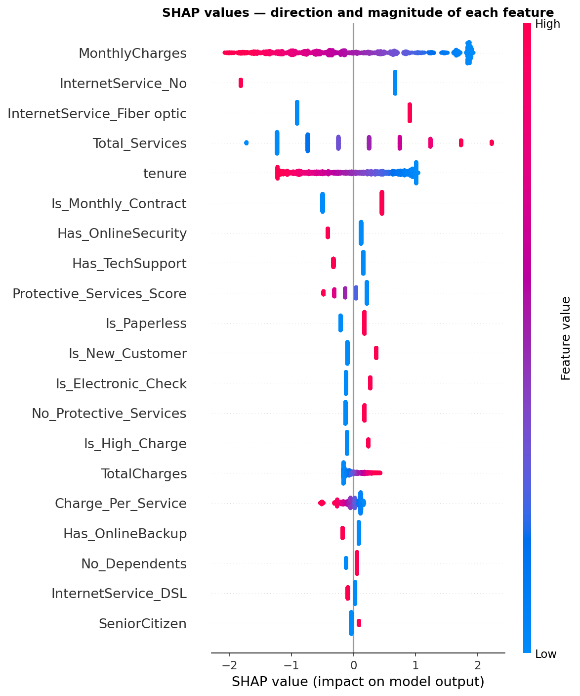
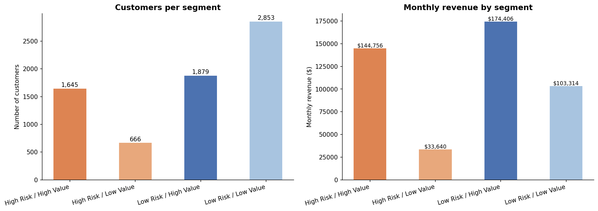
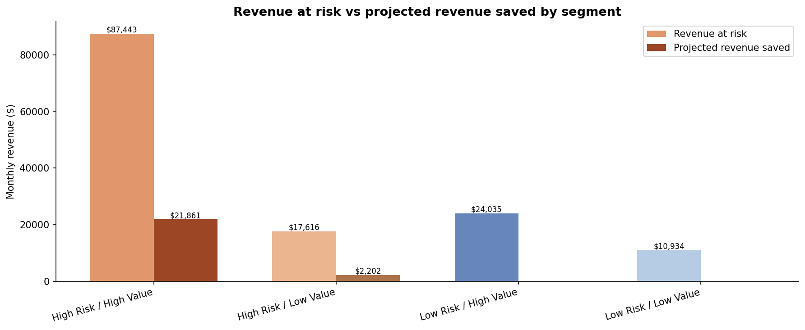

# SaaS Customer Churn — Prediction and Retention Analysis

## Business Objective

Every month, about 1 in 4 customers stops paying. That is not a
rounding error. It is a structural problem that compounds. This
project does two things: figures out which customers are most likely
to leave before they do, and turns that into a concrete retention
strategy with a projected dollar impact.

---

## Dataset

- **Source:** IBM Watson Telco Customer Churn
- **Size:** 7,043 customers, 21 features
- **Target:** Churn (Yes/No) — 26.5% positive class
- **Data type:** Real customer data, not synthetic

---

## What I found before building any model

Five signals stood out before any modeling:

| Signal | Without | With | Difference |
|--------|---------|------|------------|
| Tech support | 41.6% churn | 15.2% churn | 2.7x |
| Online security | 41.8% churn | 14.6% churn | 2.9x |
| Electronic check vs auto payment | 45.3% churn | ~16% churn | 3x |
| Month-to-month vs two-year contract | 42.7% churn | 2.8% churn | 15x |
| First 12 months vs 49+ months tenure | 47.7% churn | 9.5% churn | 5x |

The high-risk customer profile is consistent across all five signals:
month-to-month contract, new customer, no protective services, paying
by electronic check. That is what the model learned to catch.

---

## Modeling approach

Three models compared with 5-fold cross-validation:

| Model | AUC-ROC | Recall | Precision |
|-------|---------|--------|-----------|
| Logistic Regression | 0.839 | 0.701 | 0.553 |
| Random Forest | 0.824 | 0.496 | 0.640 |
| XGBoost | 0.819 | 0.522 | 0.615 |

Best model: Logistic Regression — AUC-ROC 0.839 on held-out test set.
Threshold tuned to 0.35 to prioritize recall — catches 7 in 10 churners.
SHAP analysis revealed MonthlyCharges as the top churn driver, ranking
above contract type which dominated the EDA findings.

The classification threshold was chosen deliberately. For churn
prediction, missing a churner costs more than a false alarm. Higher
recall was prioritized over precision, with that tradeoff documented
explicitly.

---

## Retention strategy and revenue impact

Every customer was scored with the trained model and segmented into
four groups based on churn risk (threshold 0.35) and value (median
monthly charge of $70.35).

| Segment | Customers | Avg Monthly Charge | Avg Tenure | Churn Rate | Monthly Revenue | Revenue at Risk |
|---------|-----------|--------------------|------------|------------|------------------|------------------|
| High Risk / High Value | 1,645 (23.4%) | $88.00 | 17 months | 60.0% | $144,756 | $87,443 (60.4%) |
| High Risk / Low Value | 666 (9.5%) | $50.51 | 5 months | 51.0% | $33,640 | $17,616 (52.4%) |
| Low Risk / High Value | 1,879 (26.7%) | $92.82 | 54 months | 13.0% | $174,406 | $24,035 (13.8%) |
| Low Risk / Low Value | 2,853 (40.5%) | $36.21 | 33 months | 10.0% | $103,314 | $10,934 (10.6%) |

Total revenue at risk: **$140,028/month** (30.7% of total monthly revenue)

### Recommended interventions

| Segment | Action | Budget allocation | Projected churn reduction |
|---------|--------|--------------------|----------------------------|
| High Risk / High Value | Proactive outreach + contract upgrade incentive | 70% | 25% → $21,861/month saved |
| High Risk / Low Value | Automated email + free service add-on trial | 15% | 12.5% → $2,202/month saved |
| Low Risk / High Value | Loyalty recognition + upsell campaign | 15% | Maintain current churn rate |
| Low Risk / Low Value | Monitor only | 0% | No change expected |

### Projected outcome

- **Monthly revenue saved:** $24,063
- **Annual revenue saved:** $288,756

The output of this project is not just a model. It is a
dollar-quantified retention strategy, prioritizing spend on the
segment where it matters most: customers who are both likely to
leave and worth keeping.

---

## Key takeaways

- 2-year contracts reduce churn by 15x compared to month-to-month
- MonthlyCharges, not contract type, is the strongest predictor in the
  trained model. EDA correlation and model-driven feature importance
  can diverge, and that gap is where the real insight is
- Threshold tuning (0.35 instead of 0.5) reflects a real business
  tradeoff: missing a churner is more costly than a false alarm
- Concentrating retention spend on the High Risk / High Value segment
  alone projects $288,756 in annual revenue saved

### What I would do next with more time

- Add customer support interaction data as features
- Build a survival analysis model to predict time-to-churn
- Deploy the model as a weekly scoring pipeline
- A/B test retention interventions to validate projected impact

---

## Project structure

    saas-churn-analysis/
    │
    ├── 01_eda.ipynb                  # Done — EDA and key findings
    ├── 02_feature_engineering.ipynb  # Done — 25 engineered features
    ├── 03_modeling.ipynb             # Done — logistic regression, SHAP, threshold tuning
    ├── 04_retention_strategy.ipynb   # Done — segmentation, revenue impact, recommendations
    ├── requirements.txt
    │
    └── figures/
        ├── churn_distribution.png
        ├── churn_by_contract.png
        ├── churn_by_tenure.png
        ├── churn_by_services.png
        ├── churn_by_payment.png
        ├── model_comparison.png
        ├── roc_curve.png
        ├── confusion_matrix.png
        ├── shap_importance.png
        ├── shap_dotplot.png
        ├── segment_distribution.png
        └── revenue_impact.png

---

## Tools and technologies

- **Python:** pandas, numpy, scikit-learn, XGBoost, SHAP, matplotlib, seaborn
- **Data:** IBM Watson Telco Customer Churn (real data, not synthetic)

---

## How to run

Open notebooks in Google Colab or Jupyter in order: 01 to 02 to 03 to 04

No downloads needed. Data loads automatically from IBM's public GitHub in notebook 01.

Source: https://github.com/IBM/telco-customer-churn-on-icp4d

*All analysis is for portfolio purposes.*
