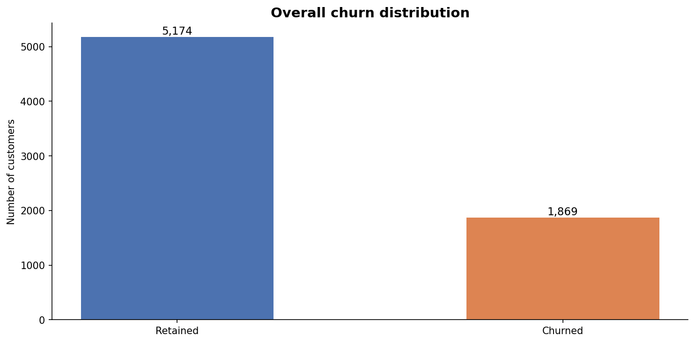
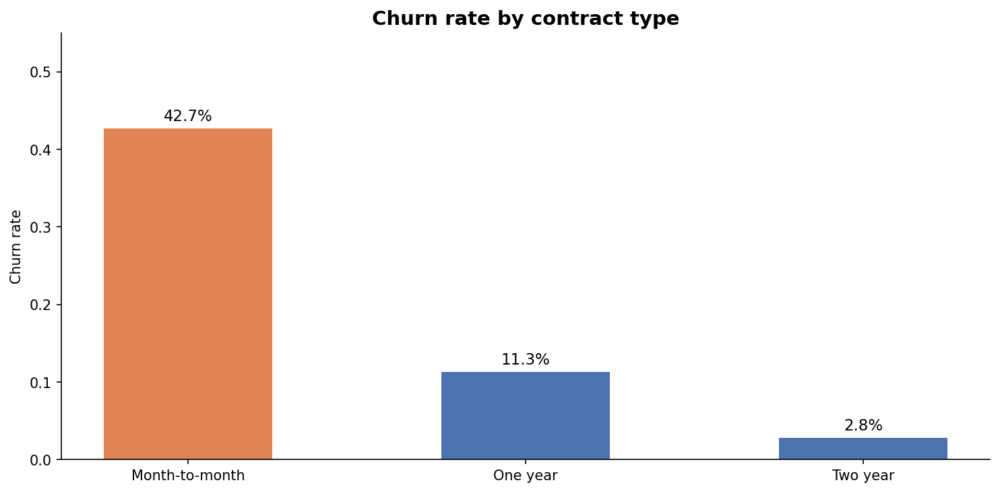
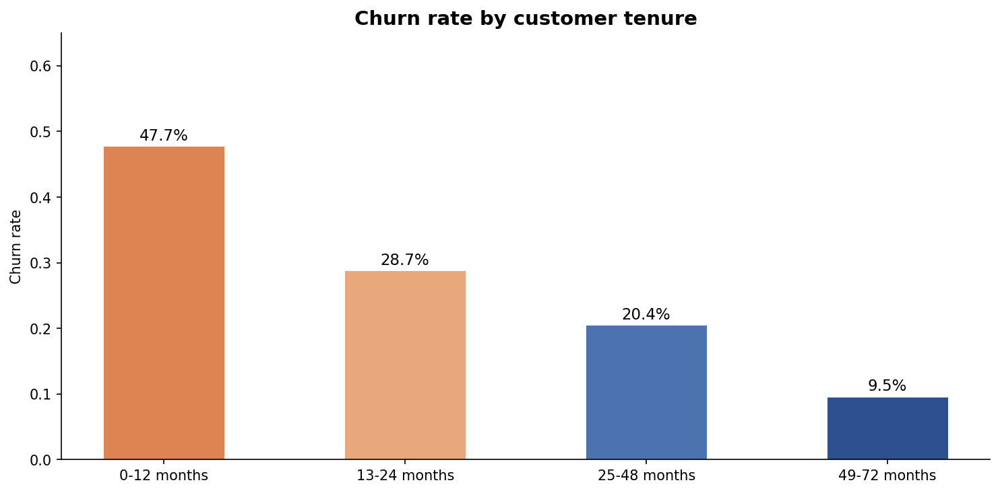
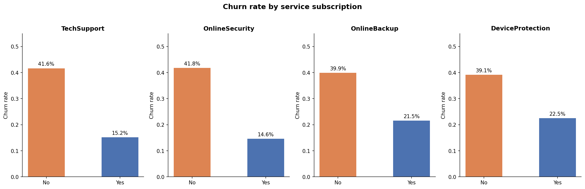
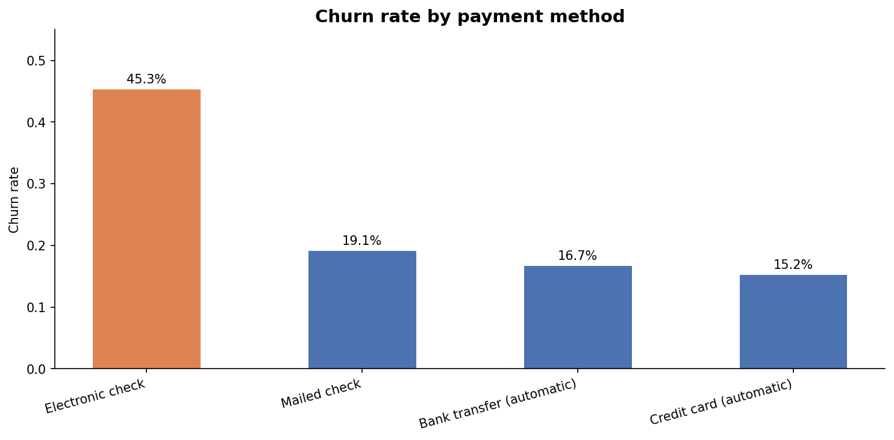

# SaaS Customer Churn — Prediction and Retention Analysis

## Business Objective

Every month, about 1 in 4 customers stops paying. That is not a 
rounding error. It is a structural problem that compounds. This 
project does two things: figures out which customers are most likely 
to leave before they do, and turns that into a concrete retention 
strategy with a projected dollar impact.

---

## Dataset

- **Source:** IBM Watson Telco Customer Churn
- **Size:** 7,043 customers, 21 features
- **Target:** Churn (Yes/No) — 26.5% positive class
- **Data type:** Real customer data, not synthetic

---

## What I found before building any model

Five signals stood out before any modeling:

| Signal | Without | With | Difference |
|--------|---------|------|------------|
| Tech support | 41.6% churn | 15.2% churn | 2.7x |
| Online security | 41.8% churn | 14.6% churn | 2.9x |
| Electronic check vs auto payment | 45.3% churn | ~16% churn | 3x |
| Month-to-month vs two-year contract | 42.7% churn | 2.8% churn | 15x |
| First 12 months vs 49+ months tenure | 47.7% churn | 9.5% churn | 5x |

The high-risk customer profile is consistent across all five signals: 
month-to-month contract, new customer, no protective services, paying 
by electronic check. That is what the model learned to catch.

---

## Modeling approach

Three models compared with 5-fold cross-validation:

| Model | AUC-ROC | Recall | Precision |
|-------|---------|--------|-----------|
| Logistic Regression | | | |
| Random Forest | | | |
| XGBoost | | | |

*(Results updated after notebook 03)*

The classification threshold was chosen deliberately. For churn 
prediction, missing a churner costs more than a false alarm. Higher 
recall was prioritized over precision, with that tradeoff documented 
explicitly.

SHAP values explain individual predictions rather than just ranking 
feature importance. That distinction matters when the goal is 
actionable retention decisions, not just model accuracy.

---

## Retention recommendation

*(Updated after notebook 04)*

The output of this project is not just a model. It is a segmentation 
of customers by risk and value, with a budget allocation recommendation 
and projected revenue impact per segment.

---

## Project structure

    saas-churn-analysis/
    │
    ├── 01_eda.ipynb                  # Where the patterns live
    ├── 02_feature_engineering.ipynb  # Turning findings into model inputs
    ├── 03_modeling.ipynb             # Logistic regression, random forest, XGBoost + SHAP
    ├── 04_retention_strategy.ipynb   # What to actually do with the predictions
    │
    ├── churn_distribution.png
    ├── churn_by_contract.png
    ├── churn_by_tenure.png
    ├── churn_by_services.png
    └── churn_by_payment.png

---

## Tools and technologies

- **Python:** pandas, scikit-learn, XGBoost, SHAP, matplotlib, seaborn
- **Data:** IBM Watson Telco Customer Churn (real data, not synthetic)

---

## How to run

Open notebooks in Google Colab or Jupyter in order: 01 to 02 to 03 to 04

No downloads needed. Data loads automatically from IBM's public GitHub in notebook 01, no manual download needed.
Source: https://github.com/IBM/telco-customer-churn-on-icp4d

*All analysis is for portfolio purposes.*
